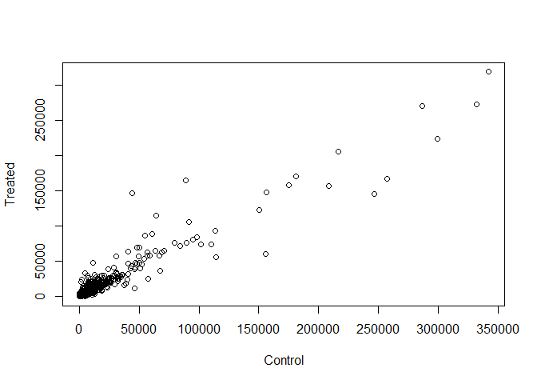
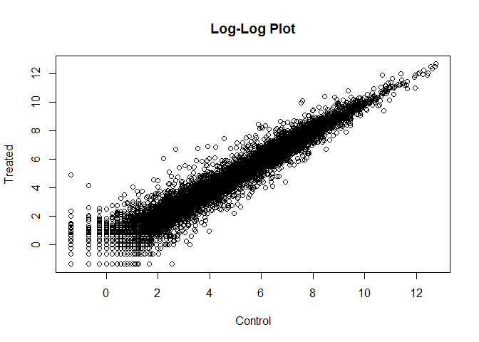
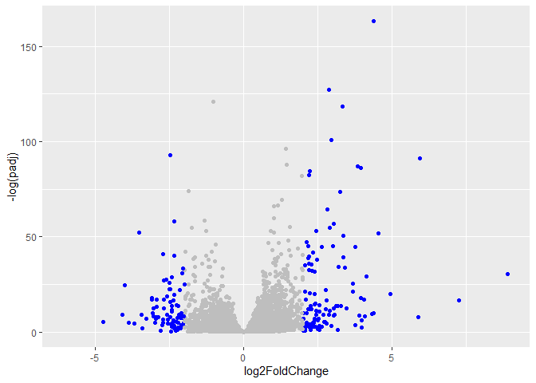

# Class 12 Lab


``` r
library(BiocManager)
```

    Warning: package 'BiocManager' was built under R version 4.5.2

``` r
library(DESeq2)
```

    Warning: package 'DESeq2' was built under R version 4.5.2

    Warning: package 'matrixStats' was built under R version 4.5.2

``` r
counts <- read.csv("airway_scaledcounts.csv", row.names=1)
metadata <-  read.csv("airway_metadata.csv")
```

> 1.  How many genes are in this dataset

``` r
nrow(counts)
```

    [1] 38694

38,694 genes

> 2.  How many control cell lines do we have?

4 cell lines

``` r
ncol(counts)
```

    [1] 8

``` r
sum(metadata$dex=="control")
```

    [1] 4

1.  Extract the “control” columns from `counts`
2.  Calculate the mean value for each gene in these “control” columns
    3-4. Do the same for the “treated” columns
3.  Compare the mean values for each gene

> 3.  How would you make the above code in either approach more robust?
>     Is there a function that could help here?

rather than manually calculating, I would use the `mean()` function

control \<- metadata\[metadata\[,“dex”\]==“control”,\] control.mean \<-
mean( counts\[ ,control\$id\] )

> 4.  

treated \<- metadata\[metadata\[,“dex”\]==“treated”,\] treated.mean \<-
mean( counts\[ ,treated\$id\] )

``` r
control <- metadata[metadata[,"dex"]=="control",]
control.counts <- counts[ ,control$id]
control.mean <- rowSums( control.counts )/4 
head(control.mean)
```

    ENSG00000000003 ENSG00000000005 ENSG00000000419 ENSG00000000457 ENSG00000000460 
             900.75            0.00          520.50          339.75           97.25 
    ENSG00000000938 
               0.75 

``` r
treated <- metadata[metadata[,"dex"]=="treated",]
treated.counts <- counts[ ,treated$id]
treated.mean <- rowSums( treated.counts )/4 
head(treated.mean)
```

    ENSG00000000003 ENSG00000000005 ENSG00000000419 ENSG00000000457 ENSG00000000460 
             658.00            0.00          546.00          316.50           78.75 
    ENSG00000000938 
               0.00 

``` r
meancounts <- data.frame(control.mean, treated.mean)
```

> 5.  

``` r
plot(meancounts[,1],meancounts[,2], xlab="Control", ylab="Treated")
```



> Q5.

I would use geom_point to do this with ggplot2

> Q6.

``` r
plot(log(meancounts[,1]),log(meancounts[,2]), xlab="Control", ylab="Treated", main='Log-Log Plot')
```



A common “rule-of-thumb” log2fold change is greater than 2

We need to remove the 0 and NaN values from the dataset because they
hinder data analysis

``` r
meancounts$log2fc <- log2(meancounts[,"treated.mean"]/meancounts[,"control.mean"])
head(meancounts)
```

                    control.mean treated.mean      log2fc
    ENSG00000000003       900.75       658.00 -0.45303916
    ENSG00000000005         0.00         0.00         NaN
    ENSG00000000419       520.50       546.00  0.06900279
    ENSG00000000457       339.75       316.50 -0.10226805
    ENSG00000000460        97.25        78.75 -0.30441833
    ENSG00000000938         0.75         0.00        -Inf

We need to remove the 0 and nan values

> Q7. The arr.ind=TRUE argument will cause which() to return both the
> row and column indices for TRUE for zero counts. Calling unique() will
> ensures we dont count twice

``` r
zero.vals <- which(meancounts[,1:2]==0, arr.ind=TRUE)

to.rm <- unique(zero.vals[,1])
mygenes <- meancounts[-to.rm,]
head(mygenes)
```

                    control.mean treated.mean      log2fc
    ENSG00000000003       900.75       658.00 -0.45303916
    ENSG00000000419       520.50       546.00  0.06900279
    ENSG00000000457       339.75       316.50 -0.10226805
    ENSG00000000460        97.25        78.75 -0.30441833
    ENSG00000000971      5219.00      6687.50  0.35769358
    ENSG00000001036      2327.00      1785.75 -0.38194109

> How may genes are up regulated at the +2 log2FC threshold? Q8. Using
> the up.ind vector above can you determine how many up regulated genes
> we have at the greater than 2 fc level? Q9. Using the down.ind vector
> above can you determine how many down regulated genes we have at the
> greater than 2 fc level?

``` r
up.ind <- mygenes$log2fc > 2
down.ind <- mygenes$log2fc < (-2)
```

> Q10. Do you trust these results? Why or why not?

No, we have not evaluated the significance of any of these changes

## deseq analysis

Proper analysis

DESeq2 wants 3 things for analysis 1. countData 2. colData 3. design

``` r
dds <- DESeqDataSetFromMatrix(counts, metadata, ~dex)
```

    converting counts to integer mode

    Warning in DESeqDataSet(se, design = design, ignoreRank): some variables in
    design formula are characters, converting to factors

The main function in the DEQeq package to run analysis is called
`DESeq()`

``` r
dds <- DESeq(dds)
```

    estimating size factors

    estimating dispersions

    gene-wise dispersion estimates

    mean-dispersion relationship

    final dispersion estimates

    fitting model and testing

Getting Results `results()`

``` r
res <- results(dds)
head(res)
```

    log2 fold change (MLE): dex treated vs control 
    Wald test p-value: dex treated vs control 
    DataFrame with 6 rows and 6 columns
                      baseMean log2FoldChange     lfcSE      stat    pvalue
                     <numeric>      <numeric> <numeric> <numeric> <numeric>
    ENSG00000000003 747.194195     -0.3507030  0.168246 -2.084470 0.0371175
    ENSG00000000005   0.000000             NA        NA        NA        NA
    ENSG00000000419 520.134160      0.2061078  0.101059  2.039475 0.0414026
    ENSG00000000457 322.664844      0.0245269  0.145145  0.168982 0.8658106
    ENSG00000000460  87.682625     -0.1471420  0.257007 -0.572521 0.5669691
    ENSG00000000938   0.319167     -1.7322890  3.493601 -0.495846 0.6200029
                         padj
                    <numeric>
    ENSG00000000003  0.163035
    ENSG00000000005        NA
    ENSG00000000419  0.176032
    ENSG00000000457  0.961694
    ENSG00000000460  0.815849
    ENSG00000000938        NA

## Volcano Plot

Log2FC vs padj

``` r
plot(res$log2FoldChange, -log(res$padj))
abline(v=c(-2, 2), col="red")
abline(h=-log(0.05), col="red")
```


## Save Results

``` r
write.csv(res, file="myresults.csv")
```

``` r
library(ggplot2)
```

    Warning: package 'ggplot2' was built under R version 4.5.2

``` r
mycols <- rep("grey", nrow(res))
mycols[abs(res$log2FoldChange)>2] <- "blue"
mycols[res$padk >- 0.05] <- "grey"
ggplot(res) + aes(log2FoldChange, -log(padj)) +geom_point(col=mycols)
```

    Warning: Removed 23549 rows containing missing values or values outside the scale range
    (`geom_point()`).



## Adding Data Annotations

ENSEMBL database IDs are in the `res` object –\> use `mapIds()` function
from bioconductor

``` r
library("AnnotationDbi")
library("org.Hs.eg.db")
```

``` r
res$symbol <- mapIds(org.Hs.eg.db,
                     keys=row.names(res), # Our genenames
                     keytype="ENSEMBL",        # The format of our genenames
                     column="SYMBOL",          # The new format we want to add
                     multiVals="first")
```

    'select()' returned 1:many mapping between keys and columns

``` r
head(res$symbol)
```

    ENSG00000000003 ENSG00000000005 ENSG00000000419 ENSG00000000457 ENSG00000000460 
           "TSPAN6"          "TNMD"          "DPM1"         "SCYL3"         "FIRRM" 
    ENSG00000000938 
              "FGR" 

``` r
res$genename <- mapIds(org.Hs.eg.db,
                     keys=row.names(res), # Our genenames
                     keytype="ENSEMBL",        # The format of our genenames
                     column="GENENAME",          # The new format we want to add
                     multiVals="first")
```

    'select()' returned 1:many mapping between keys and columns

``` r
res$entrezid <- mapIds(org.Hs.eg.db,
                     keys=row.names(res), # Our genenames
                     keytype="ENSEMBL",        # The format of our genenames
                     column="ENTREZID",          # The new format we want to add
                     multiVals="first")
```

    'select()' returned 1:many mapping between keys and columns

\##Pathway Analysis **gage** function in R

``` r
library(gage)
```

``` r
library(gageData)
library(pathview)
```

    ##############################################################################
    Pathview is an open source software package distributed under GNU General
    Public License version 3 (GPLv3). Details of GPLv3 is available at
    http://www.gnu.org/licenses/gpl-3.0.html. Particullary, users are required to
    formally cite the original Pathview paper (not just mention it) in publications
    or products. For details, do citation("pathview") within R.

    The pathview downloads and uses KEGG data. Non-academic uses may require a KEGG
    license agreement (details at http://www.kegg.jp/kegg/legal.html).
    ##############################################################################

**gage** wants an input as a named vector of importance (labeled fold
changes)

``` r
foldchanges <- res$log2FoldChange
data(kegg.sets.hs)
names(foldchanges) = res$entrezid
```

``` r
keggres = gage(foldchanges, gsets=kegg.sets.hs)
```

``` r
pathview(gene.data=foldchanges, pathway.id="hsa05310")
```

    'select()' returned 1:1 mapping between keys and columns

    Info: Working in directory C:/Users/ianmk/Documents/BGGN213/Class12Lab

    Info: Writing image file hsa05310.pathview.png
